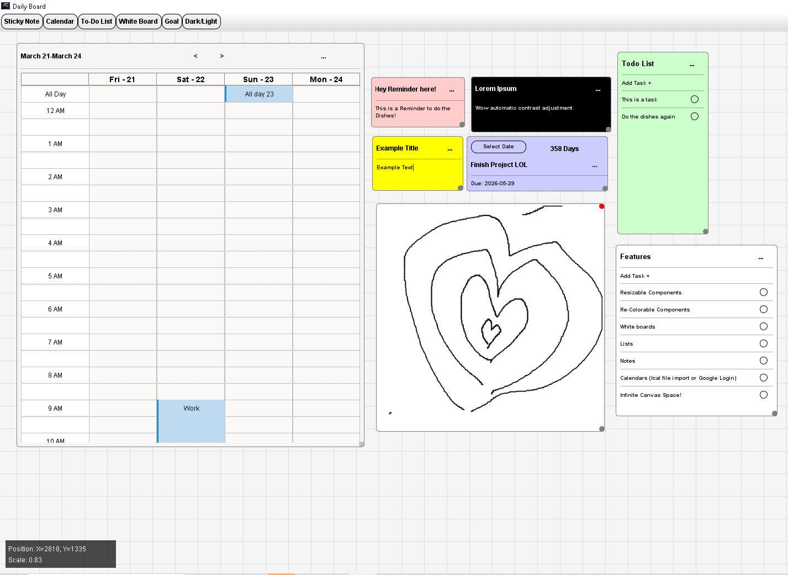
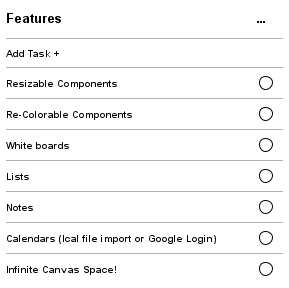

# DailyBoard
A Daily Planner Inspired By Outlooks (Now Extinct) Daily Board

# Daily Board - Java Swing Desktop App

A **Java Swing desktop application** that functions like Outlook's Daily Board, integrating with **Google Calendar** to display events, tasks, notes, and reminders.

## Features
✅ Java Swing UI for a lightweight, responsive desktop experience  
✅ Google Calendar API integration 
✅ Task management, reminders, and scheduling  
✅ Cross-platform support with Java(Windows, macOS, Linux)  

 

## Setup & Installation
### Prerequisites
- Java 17+ (JDK)
- Maven (for dependency management)

### Clone the Repository
~~~
git clone (however you like)
~~~

### Install dependencies with maven
~~~
mvn clean install
~~~

### Run code locally
~~~
mvn exec:java
~~~